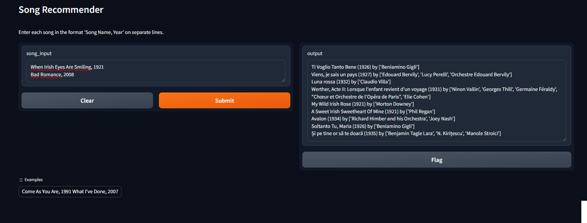

# fizy_muzik_onerme (Music Recommendation System)

## Project Overview
fizy_muzik_onerme is a music recommendation system developed for the Turkcell Hackathon Fizy application. This project extends a Kaggle-based music recommendation system, enhancing it with a user-focused experience and integrating a chatbot interface using Gradio.

## Features
- Song recommendation based on user input
- Chatbot interface for interactive music recommendations
- Data visualization for music trends and genres
- Clustering of songs and genres
- Integration with Spotify API for up-to-date song information

## Installation
1. Clone the repository:
   ```
   git clone https://github.com/your-username/fizy_muzik_onerme.git
   cd fizy_muzik_onerme
   ```
2. Install required dependencies:
   ```
   pip install -r requirements.txt
   ```

## Usage
1. Run the main script:
   ```
   python Prototip.py
   ```
2. Open the provided Gradio interface URL in your web browser.
3. Interact with the chatbot by entering song names or describing your music preferences.

## Dependencies
- pandas
- numpy
- scikit-learn
- spotipy
- gradio
- plotly
- seaborn
- matplotlib

## Data Sources
The project uses the Spotify dataset available on Kaggle. You can find more information about the original dataset [here](https://www.kaggle.com/code/vatsalmavani/music-recommendation-system-using-spotify-dataset/notebook).

## Development
This project is continuously evolving. Future plans include:
- Enhanced chatbot integration for a more intuitive user experience
- Improved recommendation algorithms
- Extended genre and mood-based recommendations

## Demo
A prototype of the application is available at: https://b9918e87ffdb99b9c7.gradio.live/




## Contributing
Contributions to improve fizy_muzik_onerme are welcome. Please feel free to submit pull requests or open issues to discuss potential enhancements.

## License
[Include license information here]

## Acknowledgements
- Original Kaggle project by Vatsal Mavani
- Spotify API for providing music data
- Gradio for the web interface framework
